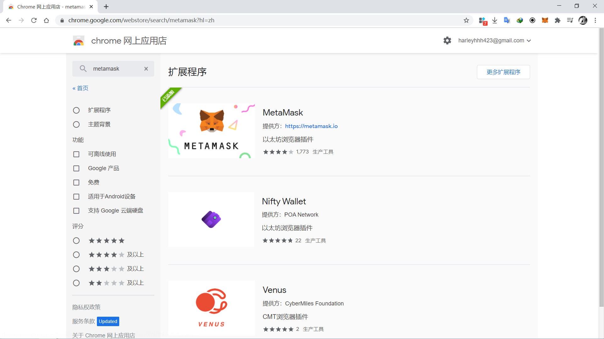
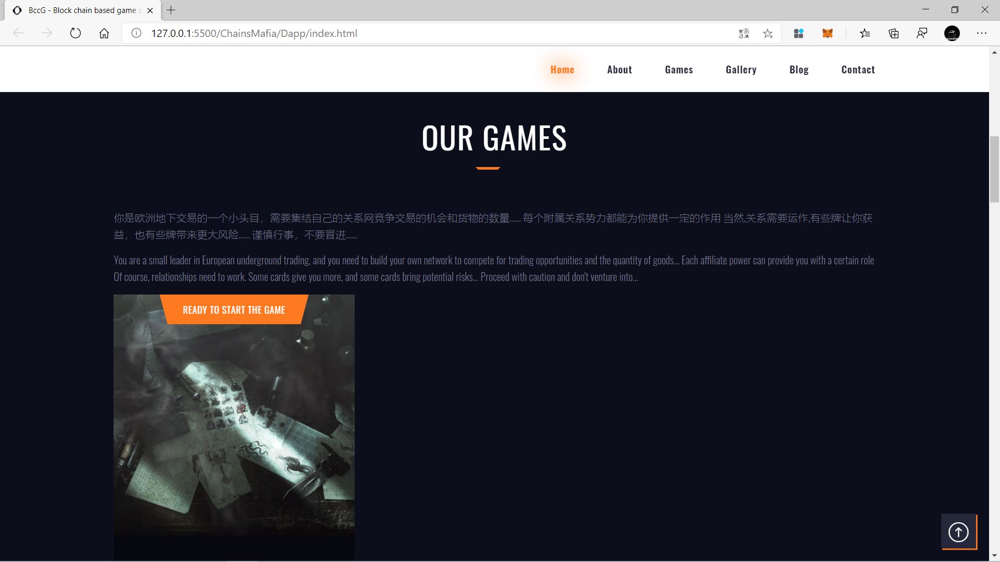
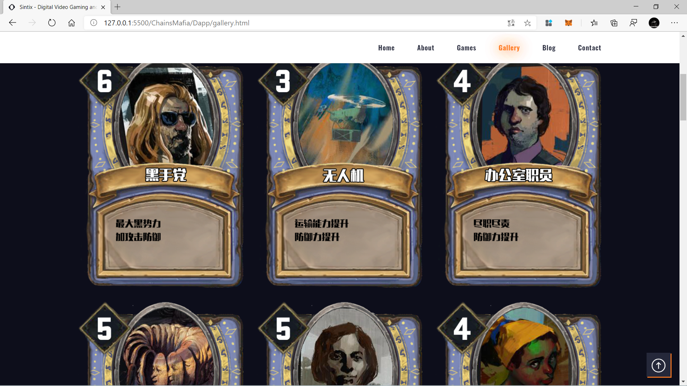
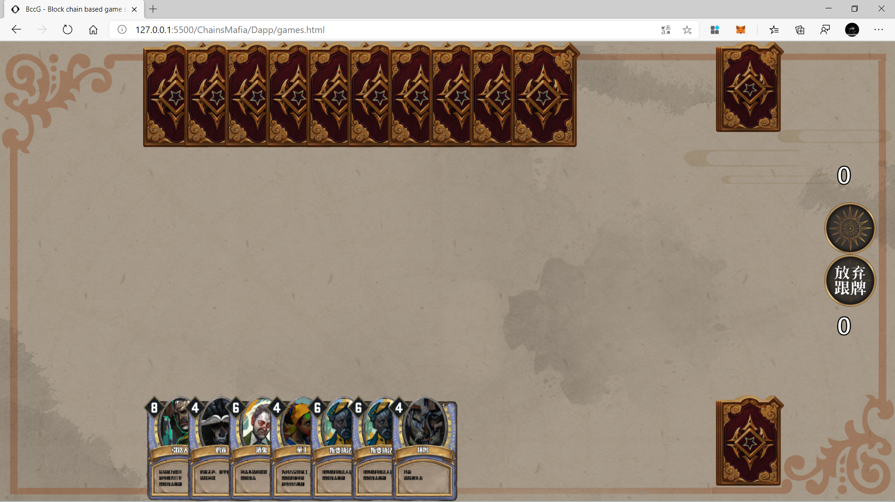

# 用户手册
> **CHAINS TRADE OF UNDERGROUND MAFIA**
<br><br>
>游戏背景介绍：
<font color="">```你是欧洲地下交易的一个小头目，需要集结自己的关系网竞争交易的机会和货物的数量......
每个附属关系势力都能为你提供一定的作用 当然,关系需要运作,有些牌让你获益，也有些牌带来更大风险...... 谨慎行事，不要冒进......```
```You are a small leader in European underground trading, and you need to build your own network to compete for trading opportunities and the quantity of goods... Each affiliate power can provide you with a certain role Of course, relationships need to work. Some cards give you more, and some cards bring potential risks... Proceed with caution and don't venture into...```
</font>
### 游戏配置
##### 本项目使用Truffle架构+Solidity智能合约+MetaMask钱包进行开发。玩家无需搭建自己的游玩环境，只需要选择支持MetaMask区块链钱包的Chrome、FireFox、Microsoft Edge三大浏览器之一，您就可以游玩我们的区块链虚拟资产交易市场和对战卡牌游戏。

#### 1.下载支持的浏览器
>任选Chrome、FireFox、Microsoft Edge三大浏览器之一。

#### 2.安装MetaMask浏览器插件，创建账户
>创建账户之后请导出保存您的9个助记词，以便帮助你找回你遗失的账户。

### 3.移植账户
>如果你想将同一个账户移植到另一个浏览器或者另一台电脑上，请同时导出并保存9个助记词和每个账户的密钥。

### 4.选择测试链
>我们的项目部署在Infura的Ropsten测试链环境下，请在MetaMask中选择Ropsten测试链。并在[“水龙头”](http://faucet.metamask.io/)等网站获取所需要的测试币。

### 5.申请代币
>您的资产讯息请在MyAccount页面查看。使用你的MetaMask账户申请我们的ERC777标准的TF7代币作为你的交易代币。我们会根据实际情况为每个需要的用户颁布适当数量的代币。页面显示您当前的ERC777和ERC721代币“TF7”和“NTF”的余额。将您的非同质化代币— —卡牌显示在牌库中。

### 6.市场交易
>我们在Game-Market页面提供商品上架、商品下架、拒绝交易、接受交易的完整交易流程。用户可自行组织资产交易，具体玩法请自己探索。

### 7.游戏对战（Todo）
>我们在Game页面进行申请对局。设计加入等待队列、寻找对手、创建对局、授权对局的完整流程。很遗憾，由于Solidity与Web3.js单向主动交互的特性，游戏对局过程中可能出现延迟很高、信息有误的现象。如果发生，请您点击Cancel Game重新进行游戏。游戏机制模仿巫师系列的昆特牌，改变了出牌机制，在用户的ERC721代币（卡牌）中选择最多15个，最低不限的卡牌，进行三局两胜的对战，每张卡片都有对应的能力点和正作用和副作用。


### 7.感谢体验
>如果你喜欢我们的项目，非常感谢。

# 测试文档

**本次测试使用Microsoft Edge和FireFox进行。**

### 1.安装MetaMask插件



### 2.注册账户


### 3.选择正确的网络


### 4.到水龙头获取Ropsten测试币


### 5.访问我们的网站

**[ChainsMafia](www.sparrowoo.top/ChainsMafia)**

**```前端测试环境在本地，智能合约已部署在Ropsten测试网络```**


### 6.背景介绍

**你是欧洲地下交易的一个小头目，需要集结自己的关系网竞争交易的机会和货物的数量...... 每个附属关系势力都能为你提供一定的作用 当然,关系需要运作,有些牌让你获益，也有些牌带来更大风险...... 谨慎行事，不要冒进......**

You are a small leader in European underground trading, and you need to build your own network to compete for trading opportunities and the quantity of goods... Each affiliate power can provide you with a certain role Of course, relationships need to work. Some cards give you more, and some cards bring potential risks... Proceed with caution and don't venture into...



### 7.卡牌介绍与认识

>打开gallery.html认识24种不同的卡牌角色
>
>
>
>
>
>
>
>

### 8.查看个人资产


### 9.请求颁发TF7货币和NTF货币


### 10.创建交易


### 11.交易市场查看


### 12.报价交易


### 13.确认或取消交易

**```这里选择确认交易```**


### 14.查看交易结果

**```市场清空，买家账户扣除TF7费用，NTF卡牌到账```**

**```卖家账户获得TF7报酬，NTF卡牌转账```**


### 15.游戏对局

**```Start Game:加入排队队列```**

**```Get Oppenont 寻找对手```**

**```Count Gamer:查看当前排队人数```**

**```Creat Game:创建对局，准备相应数据```**

**```Access Opponent:查看对局是否开始，授权开始游戏```**

**```Cancel Game:重置等待状态，撤销游戏对局```**

**```当前无人游玩```**


**```双方Start Game加入排队```**


**```当前游玩人数更新```**


**```寻找到对手后创建对局```**


**```双方授权开始游戏```**


**```游戏开始```**

